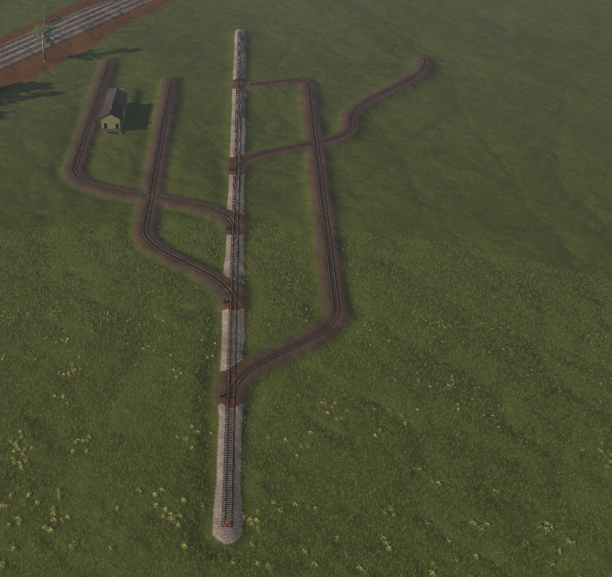
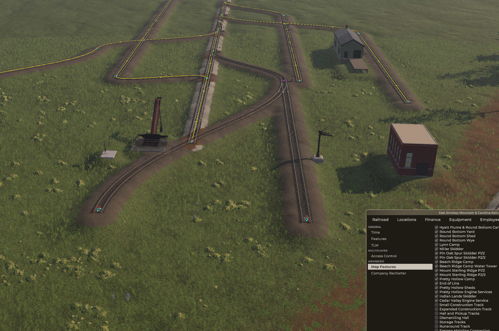
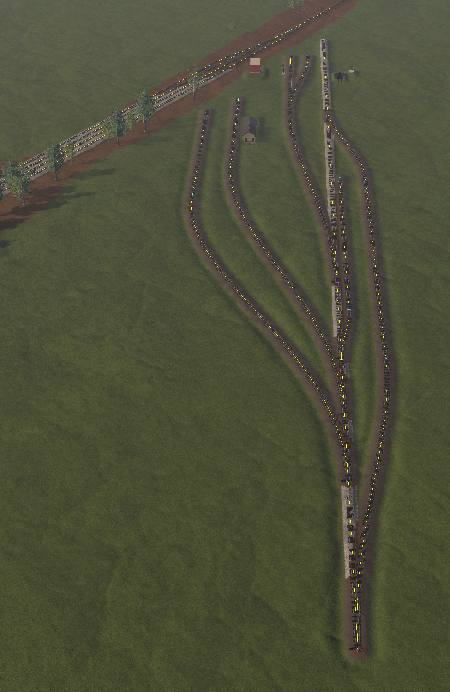

# From the drawing to an edited district

[Example index](README.md) · [Full game-graph walkthrough](WALKTHROUGH.md) · [Current placement](PLACEMENT.md) · [Validation](VALIDATION.md)

This page follows the user's Cedar Valley editor session. It explains what each siding is for, how the service expansion appears, and how to preserve geometry and object edits in a dual runtime package.

## Start with what the screenshot actually proves

*User-supplied screenshot before adjustment. Tracks and the works building render, while several approaches need reshaping.*

The initial connected graph was useful for teaching IDs and relationships. Its sharp bends and crossings were a reason to edit the layout. A successful JSON load does not establish usable railway geometry.

*The Map Features panel shows Cedar Valley Engine Service enabled. Service tracks, the brick building and loader fixtures are visible.*

This is evidence of visible feature activation in the user's session. It does not demonstrate construction orders, payment, locomotive refueling, save/reload or the same behavior in both runtimes. The screenshots do not record exact runtime/game build identities.

## Identify a track by its ID

Use the editor tooltip and the graph's IDs, not the track's current shape.

| Segment / span | Intended job | Availability |
| --- | --- | --- |
| `cvw-s-interchange` / `cvw-p-interchange` | Interchange exchange track on the loop | Base district |
| `cvw-s-factory` / `cvw-p-factory` | Unfinished-crate receiving and finished-crate shipping | Base district |
| `cvw-s-team` / `cvw-p-team` | Public freight profiles | Base district |
| `cvw-s-construction` / `cvw-p-construction` | Construction deliveries for the service milestone | Track exists before the service unlock |
| `cvw-s-repair` / `cvw-p-repair` | Repair/overhaul and repair-parts receiving | Service expansion |
| `cvw-s-fuel` / `cvw-p-fuel` | Coal and diesel receiving; optional Bunker C receiving | Service expansion |

The original **S-shaped track** was the construction siding. Its shape was incidental. The phase requests two carloads of building supplies, two of rails and a payment of 2,500. After completion, the track remains and the construction component retires.

The **fuel receiving track** feeds `cvw-service`'s shared coal/diesel storage through its unloading components. The physical coal conveyor and diesel stand are separate fixtures bound to that industry. Their placement is not controlled by the receiving span. The example has a water column but does not define a water-delivery unloader.

## Reshape the track and preserve its bindings

*User-supplied progress screenshot. It illustrates the reshaping process, not a certified final track plan or an exact image of normalized version 1.1.0.*

Keep existing node and segment IDs when changing only positions/headings. If adding or removing segments, update their endpoint references and every affected span. FUSE uses `startNodeId/endNodeId`; RF uses `startId/endId`.

Measure actual curve lengths before changing distance or normalized span endpoints. Separate almost-overlapping nodes can leave a tiny segment: the provided export had about 3 mm between `m0` and `m1`. Version 1.1.0 corrects this to a 40-metre approach. Other nodes retain the export's records.

Track edits do not automatically reposition the area, industry markers, scenery or service fixtures. Check them individually. The worked example retains the original industry markers; their operating components continue to bind by span ID.

## Move coal, water and diesel through Objects

The user found these fixtures under the editor's **Objects** panel.

1. Enable **Cedar Valley Engine Service** while placing its fixtures.
2. Select the existing fixture by its authored ID: `cvw-loader-coal`, `cvw-loader-water` or `cvw-loader-diesel`.
3. Adjust position, elevation and rotation alongside the intended locomotive stopping place. Retain the fixture ID and its `cvw-service` industry binding.
4. Save/export, then inspect the generated data. In this session, water/coal moves were also written as `world.sceneClones` entries targeting `World/Loaders/<id>`.
5. Reconcile the saved object pose with its original loader definition before translating or rebuilding. Recheck activation with the service feature off and on, then test actual use with a locomotive.

These steps document editing existing fixtures. The exact UI path for creating a new fixture was not recorded in this session.

### Why an Objects edit can need normalization

The coal loader appeared twice in the export: once in `operations.loaders` and once as a scene transform override, with different poses. The water column also had an override. Both overrides carried `enabled: true`.

For these exact FUSE targets, `LoaderAPI.ApplyDefinition` and `SceneCloneAPI.ApplyDefinition` both set the same root object's local pose. Version 1.1.0 therefore puts the saved override pose into the loader record, keeps the prefab/industry binding, and removes the redundant scene override. RF receives the matching loader pose. This avoids carrying a second placement and an unconditional visibility instruction into the milestone example.

This is specific to the known loader roots, unit scale and source-less overrides in this export. Arbitrary scene objects can have rotated/scaled parents or cloned sources and need their own conversion.

| Fixture | Normalized position | Rotation |
| --- | --- | --- |
| Water | `(-31097.66, 526.420044, -20467.127)` | `(0, 226.75, 0)` |
| Coal | `(-31026.752, 527.295, -20378.3379)` | `(0, 136.749985, 0)` |
| Diesel | `(-31131.91866, 527.52, -20429.709308)` | `(0, 226.75, 0)` |

These are saved authoring poses, not proof of correct reach, clearance or terrain contact.

## Add an engine shed as an optional exercise

A shed can go over the repair siding, using a verified model from a loaded catalog. Give it a stable scenery instance ID, then include that instance in the service feature's `gameObjectsEnableOnUnlock` list.

Follow the existing scenery mapping: FUSE uses the authored instance ID; RF uses the `scenery://` instance reference for feature-controlled scenery. Verify the selected model's own FUSE/RF asset identifiers separately. The existing repair component provides the operational function; adding a building does not create another repair component.

No engine-shed model or dependency is included in the supplied export or version 1.1.0. This is an extension exercise.

## Export once, review both runtime branches

The supplied folder contained two valid-looking graph files, but only its FUSE graph had the new node placements. The RF graph was still the original layout.

Version 1.1.0 records the untouched [session export](reference/editor-session-export.fuse.json) as evidence and the reviewed changes in [layout-overrides.json](layout-overrides.json). The example builder applies that overlay to both graphs. Keep future edits in the builder/overlay, or explicitly adopt your edited graph files as the source.

Do not install `reference`, screenshots, recipe envelopes or tile-editor backups as extra graph files. The [four-file package](package/ExampleAuthor.CedarValleyWorks) is the candidate mod.

## Finish with operational checks

Use real deliveries to exercise construction, then verify service activation, component retirement and save/reload. Test coal/diesel deliveries into shared storage, repair-parts supply, repair/overhaul and use of each fixture. Test the optional oil recipe separately if adopted.

Repeat acceptance in each intended runtime and record its exact build. The [validation record](VALIDATION.md) distinguishes the user screenshots, saved export, offline checks and outstanding gameplay work.
