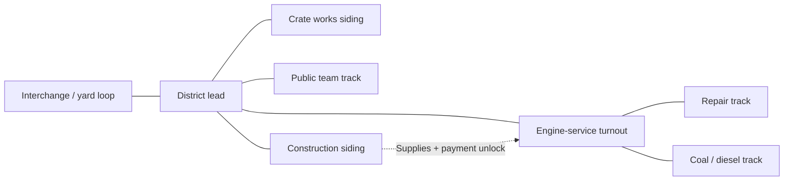

# Cedar Valley Works

[Documentation index](../../README.md) · [Small cargo example](../README.md) · [Walkthrough](WALKTHROUGH.md) · [Syntax recipes](RECIPES.md) · [Validation](VALIDATION.md)

**A fictional Railroader freight district, written once for FUSE and once for RailForge.** This is the larger worked example for modders learning to create or convert a dual runtime mod.

The district has a yard loop and interchange, a crate factory, a public team track, a construction siding, and an engine-service expansion. Its paired graphs contain **19 nodes, 19 segments, six spans, four industries, ten industry components, two custom loads, three service fixtures, two scenery objects, a map label, and a construction milestone**.

Version **1.1.0** includes the user-edited layout near **Andrews**, with matching FUSE and RailForge track/loader poses. Its entrance, `cvw-n-m0`, is at **`(-30717.615161, 527.52, -20067.424680)`**, heading **`226.75°`**. The almost-overlapping entrance nodes in the export were corrected to a 40-metre approach; the other 18 node records are retained.

The [illustrated editor workflow](EDITOR-WORKFLOW.md) explains the tracks' purposes, moving the coal/water/diesel fixtures through **Objects**, and carrying saved edits into both runtimes. The [placement page](PLACEMENT.md) records the original site reference and current rebuild process. The district still needs a verified connection to the existing railroad and operational acceptance.

## Choose a starting point

| What you want to do | Open |
| --- | --- |
| Identify tracks, move service fixtures and understand the screenshots | [Illustrated editor workflow](EDITOR-WORKFLOW.md) |
| Find the current entrance and preserve the edited layout | [Placement and rebuilding](PLACEMENT.md) |
| Read how the district works and how each system connects | [Walkthrough](WALKTHROUGH.md) |
| Inspect the entire FUSE graph | [game-graph.fuse.json](package/ExampleAuthor.CedarValleyWorks/game-graph.fuse.json) |
| Compare the entire RailForge graph | [cedar-valley.json](package/ExampleAuthor.CedarValleyWorks/RailForge/game-graph/cedar-valley.json) |
| Add passengers, a turntable, audio, masks, or advanced patches | [17 recipes and RF reference surfaces](RECIPES.md) |
| Look up any declared property in the public FUSE schema | [432-field atlas](reference/FUSE-FIELD-ATLAS.md) |
| Check detailed RailForge field mappings and compatibility limits | [Translation matrix](../../Duality%20mode%20documentation/FUSE-RailForge-Complete-Translation-Matrix.md) |
| Rebuild or check the files | [Validation and commands](VALIDATION.md) |

## Package layout

```text
CedarValleyWorks/
├── README.md, WALKTHROUGH.md, RECIPES.md, VALIDATION.md
├── PLACEMENT.md, EDITOR-WORKFLOW.md
├── placement.json         original drawing/site reference
├── layout-overrides.json  reviewed editor nodes and loader poses
├── images/                user-supplied editor screenshots
├── package/
│   └── ExampleAuthor.CedarValleyWorks/
│       ├── Info.json
│       ├── Definition.json
│       ├── game-graph.fuse.json
│       └── RailForge/game-graph/cedar-valley.json
├── recipes/       teaching envelopes and alternatives; not discovered
├── reference/     field atlas, fingerprints and unmodified editor export
├── fixtures/      patch inputs and expected results
└── tools/         example builders and validators
```

Only the four-file folder inside `package` represents a candidate mod package. The rest is teaching material. Neither runtime is a hard dependency of both branches. Test with **one runtime at a time**.

## District plan



This diagram shows connections, not engineering geometry. Use the graph's node and segment IDs for the actual topology.

## Meaning of “all syntax”

The connected core demonstrates a coherent freight mod. The companion atlas covers every **declared property location in the supplied public FUSE schema**; the recipes exercise all eight documented RF patch operators and the principal graph, handler, and sidecar families.

Not every possible provider has a public contract. Unverified custom handlers, rolling-stock internals, selectable-map parity, water polygons and other asymmetric systems are explicitly marked. Mutually exclusive options are alternatives, not fields to paste together into one giant payload.

## DELTA45 additions

The [DELTA45 review](../../Duality%20mode%20documentation/RailForge-DELTA45-Update.md) adds an optional [Bunker C freight pipeline](recipes/16-bunker-c-freight.recipe.json) and [catalog-only parts-pack example](recipes/17-catalog-only-parts.recipe.json). That review left the core graph unchanged; the subsequent Andrews placement updates its transforms. Oil-locomotive consumption and automatic RF additions have explicit runtime boundaries.

## What has been checked

The graph passes schema and reference checks. Installed FUSE and RailForge select their own files; FUSE deserializes the core; RailForge merges the graph and passes all 12 patch fixtures. The atlas's 432 field values are schema-checked individually.

Screenshots show tracks/scenery rendering and the service feature enabled; These observations do not establish completed construction deliveries, freight generation, refueling, save/reload or both-runtime gameplay. The revised entrance and normalized loader records have offline validation only. See [Validation](VALIDATION.md) for the evidence boundaries.
